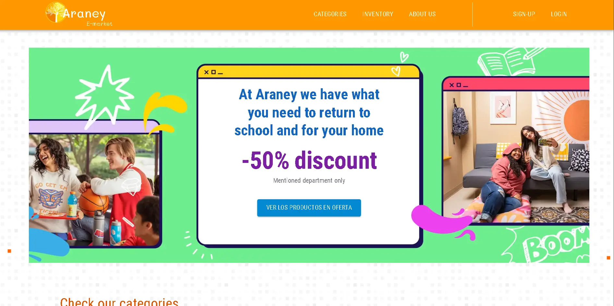
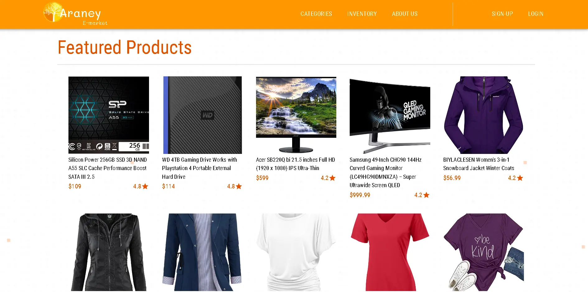
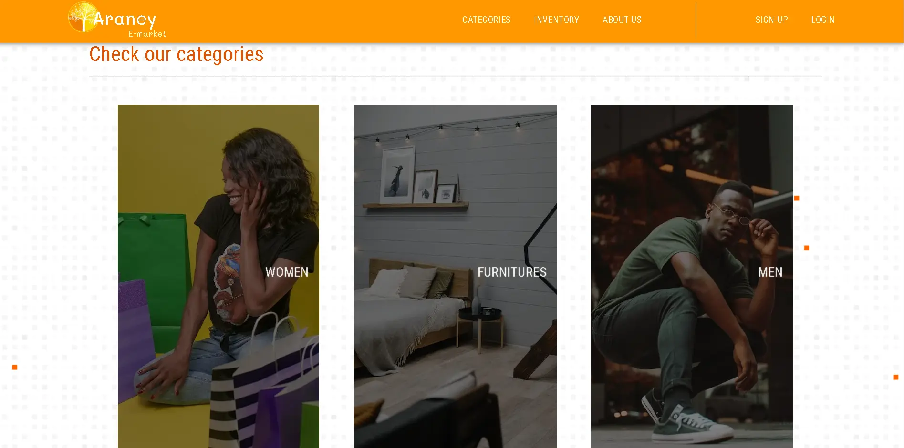
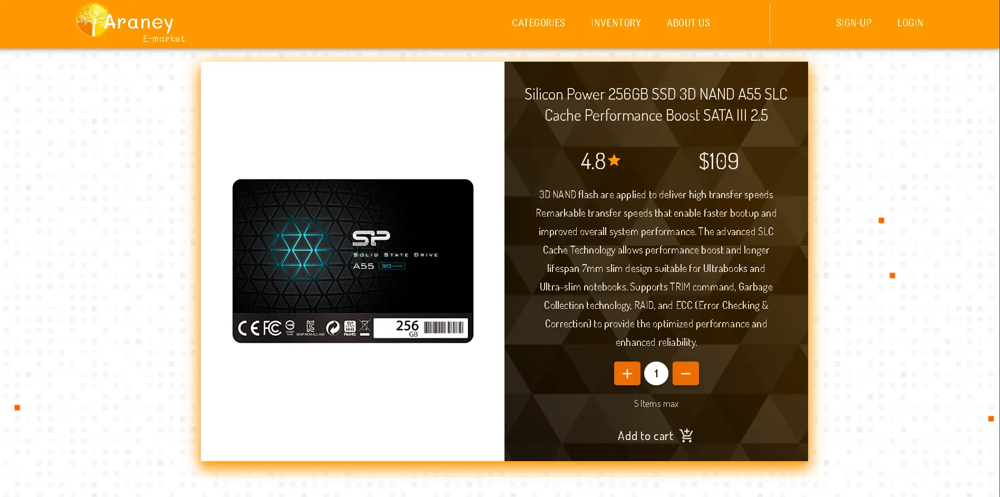
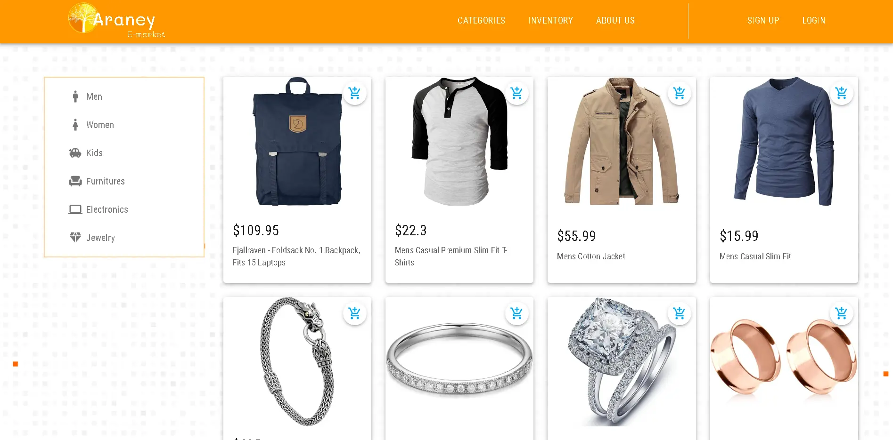
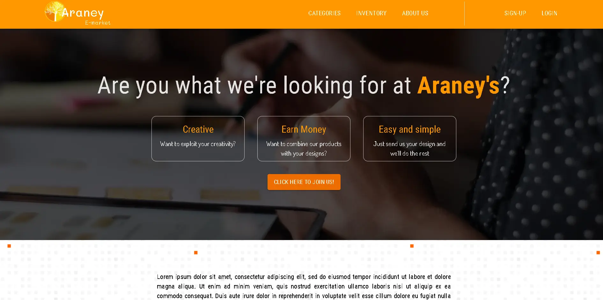
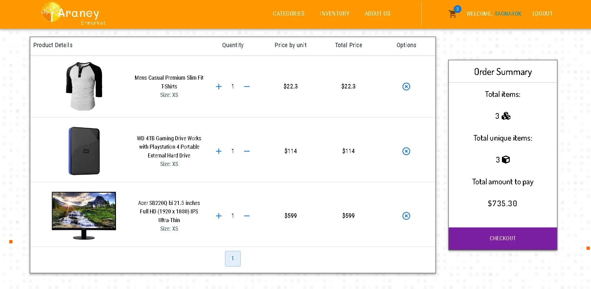

# Araney-ecommerce

<!-- Improved compatibility of back to top link: See: https://github.com/othneildrew/Best-README-Template/pull/73 -->
<a name="readme-top"></a>
<!--
*** Thanks for checking out the Best-README-Template. If you have a suggestion
*** that would make this better, please fork the repo and create a pull request
*** or simply open an issue with the tag "enhancement".
*** Don't forget to give the project a star!
*** Thanks again! Now go create something AMAZING! :D
-->


<!-- PROJECT LOGO -->
<br />
<div align="center">
  <a href="https://github.com/AubisDev/Araney-ecommerce">
    
  </a>

<h3 align="center">Araney E-Market</h3>

  <p align="center">
    Web site to simulate a real e-commerce 
    <br />
    <a href="https://github.com/AubisDev/pokemon_game"><strong>Explore the docs »</strong></a>
    <br />
    <br />
    <a href="https://pokemon-game-phi.vercel.app/home">View Demo</a>
    ·
    <a href="https://github.com/AubisDev/pokemon_game/issues">Request Feature</a>
  </p>
</div>


<!-- TABLE OF CONTENTS -->
<details>
  <summary>Table of Contents</summary>
  <ol>
    <li>
      <a href="#about-the-project">About The Project</a>
      <ul>
        <li><a href="#built-with">Built With</a></li>
      </ul>
    </li>
    <li>
      <a href="#getting-started">Getting Started</a>
      <ul>
        <li><a href="#prerequisites">Prerequisites</a></li>
        <li><a href="#installation">Installation</a></li>
      </ul>
    </li>
    <li><a href="#contact">Contact</a></li>
  </ol>
</details>


<!-- ABOUT THE PROJECT -->
## About The Project

Web
 
<br/>
<br/>

 

<p align="right">(<a href="#readme-top">back to top</a>)</p>


### Built With

* [![React][React.js]][React-url]
* [![Material UI][Material_UI]][Material_url]
* [![Typescript][Typescript]][Typescript_url]
* [![Redux][Redux]][Redux_url]
* [![React-Router][React-Router]][React-Router_url]
* [![Formik][Formik]][Formik_url]
* [![Axios][Axios]][Axios_url]
* [![Firebase][Firebase]][Firebase_url]
* [![Sweet-Alert2][Sweet-Alert2]][Sweet-Alert2_url]


<p align="right">(<a href="#readme-top">back to top</a>)</p>


<!-- GETTING STARTED -->
## Getting Started
  ```sh
  Clone the repository
  ```
 
* How to install 

  ```
   cd Araney-ecommerce
  ```
  
* yarn
  ```sh
  yarn install 
  ```
  
  ```sh
  yarn dev
  ```

<p align="right">(<a href="#readme-top">back to top</a>)</p>


<!-- APP IMAGES -->
## LIVE PAGE IMAGES

Categories section


Product page


Inventory page


About page


Cart page



<!-- CONTACT -->
## Contact

Aubis Sanchez -  - aubisdev@gmail.com

Project Link: [https://github.com/AubisDev/Araney-ecommerce](https://github.com/AubisDev/Araney-ecommerce)

<p align="right">(<a href="#readme-top">back to top</a>)</p>


<!-- MARKDOWN LINKS & IMAGES -->
<!-- https://www.markdownguide.org/basic-syntax/#reference-style-links -->

[React.js]: https://img.shields.io/badge/React-20232A?style=for-the-badge&logo=react&logoColor=61DAFB
[React-url]: https://reactjs.org/
[Material_UI]: https://img.shields.io/badge/Material%20UI-35495E?style=for-the-badge&logo=materialui&logoColor=61DAFB
[Material_url]: https://mui.com/
[Typescript]: https://img.shields.io/badge/Typescript-35495E?style=for-the-badge&logo=typescript&logoColor=61DAFB
[Typescript_url]: https://www.typescriptlang.org/
[Redux]: https://img.shields.io/badge/Redux-35495E?style=for-the-badge&logo=redux&logoColor=61DAFB
[Redux_url]: https://redux.js.org/
[React-Router]: https://img.shields.io/badge/React%20Router-35495E?style=for-the-badge&logo=react-router&logoColor=61DAFB
[React-Router_url]: https://reactrouter.com/en/main
[Formik]: https://img.shields.io/badge/Formik-35495E?style=for-the-badge&logo=formik&logoColor=61DAFB
[Formik_url]: https://formik.org/
[Yup]: https://img.shields.io/badge/Yup-35495E?style=for-the-badge&logo=yup&logoColor=61DAFB
[Yup_url]: https://www.npmjs.com/package/yup
[main-page_img]: public/mainpage.webp
[mobile-view_img]: public/mobile_view.webp
[Axios]: https://img.shields.io/badge/Axios-35495E?style=for-the-badge&logo=axios&logoColor=61DAFB
[Axios_url]: https://axios-http.com/docs/intro
[Firebase]: https://img.shields.io/badge/Firebase-35495E?style=for-the-badge&logo=firebase&logoColor=61DAFB
[Firebase_url]: https://firebase.google.com/?hl=es
[Sweet-Alert2]: https://img.shields.io/badge/Sweet-Alert2-35495E?style=for-the-badge&logo=sweet-alert2&logoColor=61DAFB
[Sweet-Alert2_url]: https://sweetalert2.github.io/
